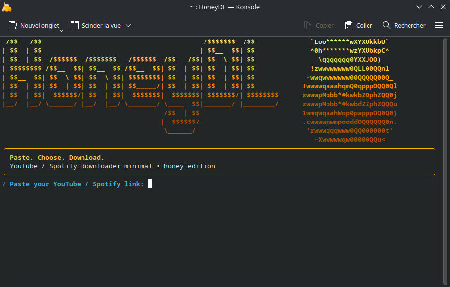

# 🍯 HoneyDL

Minimal cozy terminal downloader for YouTube & Spotify.

HoneyDL is a lightweight Linux downloader focused on:

- simplicity
- beautiful terminal UI
- fast workflow
- zero bloat

Built with:

- Python
- yt-dlp
- spotdl
- Rich
- Questionary

---

# ✨ Features

- 🎵 YouTube audio download
- 🎬 YouTube video download
- 🎧 Spotify support
- 📦 Playlist download
- 🖼️ Embedded thumbnails
- 📝 Metadata support
- 🎨 Premium ASCII terminal UI
- 🍯 Honey themed interface
- 📁 Auto organized folders
- ⚡ Multiple audio formats
- 📺 Multiple video resolutions
- 🐧 Native Linux AppImage

---

# 📸 Preview



---

# 📦 Download

Download the latest AppImage from the Releases section.

Then:

```bash
chmod +x HoneyDL-1.0.0-x86_64.AppImage
./HoneyDL-1.0.0-x86_64.AppImage
```

---

# 🐧 Supported Platforms

- Linux
- Bazzite
- Fedora
- Ubuntu
- Arch Linux
- Steam Deck

---

# 🚀 Technologies

- Python
- yt-dlp
- spotdl
- Rich
- Questionary
- PyInstaller
- AppImage

---

# 📁 Project Structure

```txt
HoneyDL/
├── honeydl/
│   ├── app.py
│   └── assets/
├── release/
├── pyproject.toml
└── README.md
```

---

# 🍯 Philosophy

HoneyDL was designed to feel:

- fast
- cozy
- terminal-native
- aesthetic
- ultra simple

No clutter.  
Just paste. Choose. Download.

---

# 📜 License

MIT
